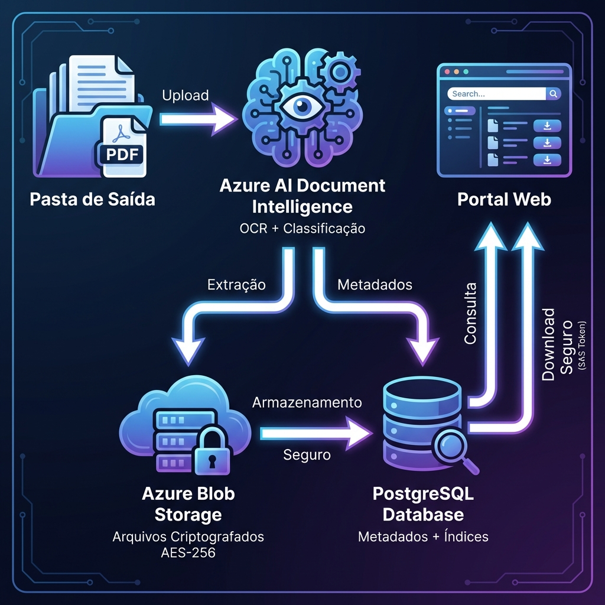
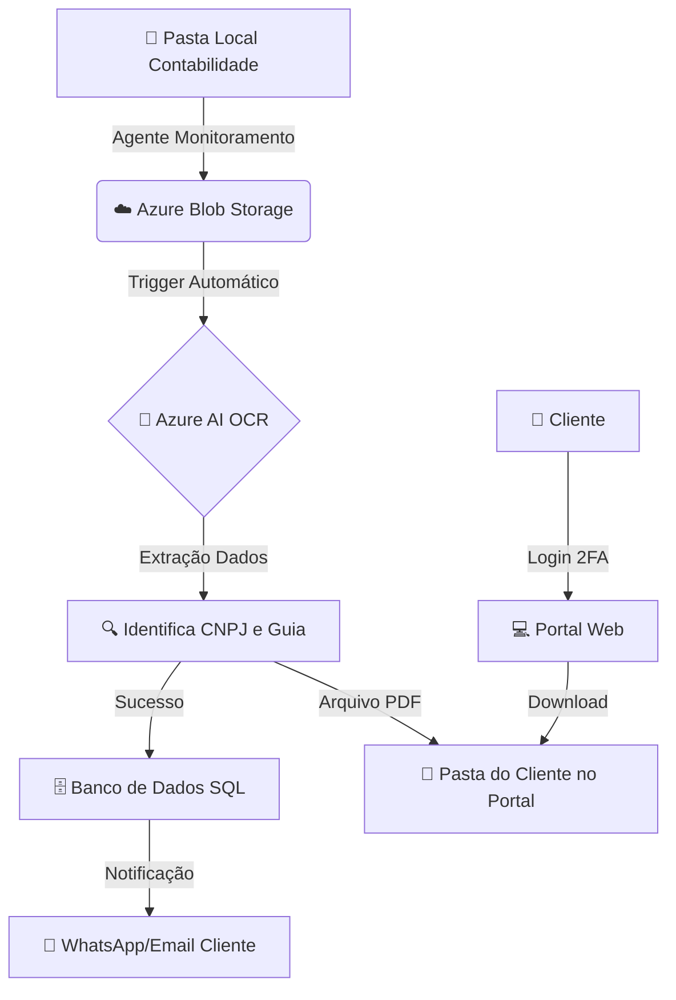
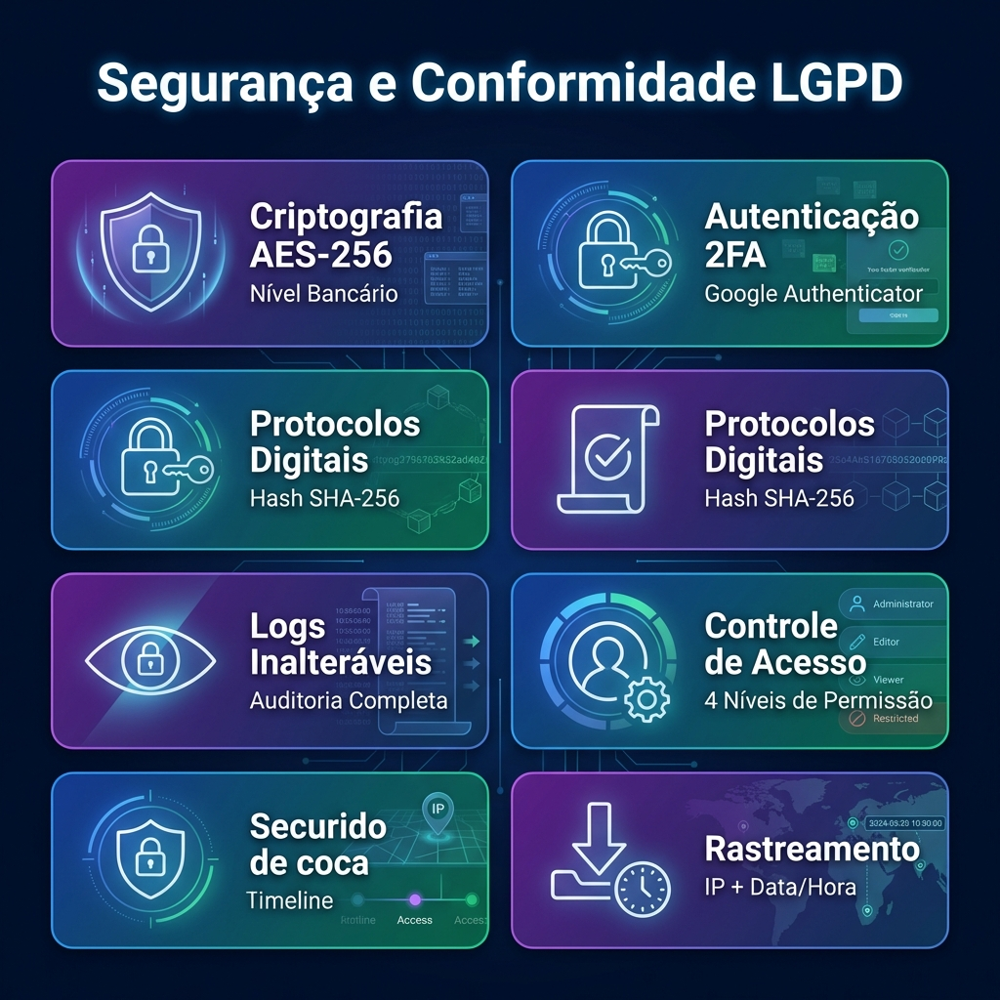
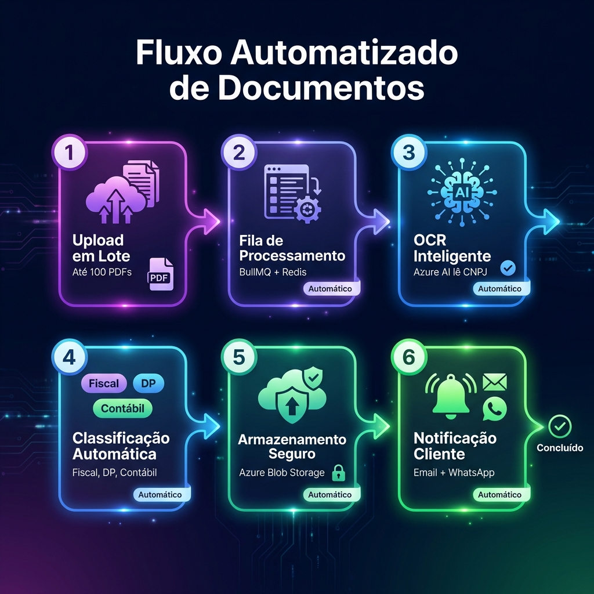
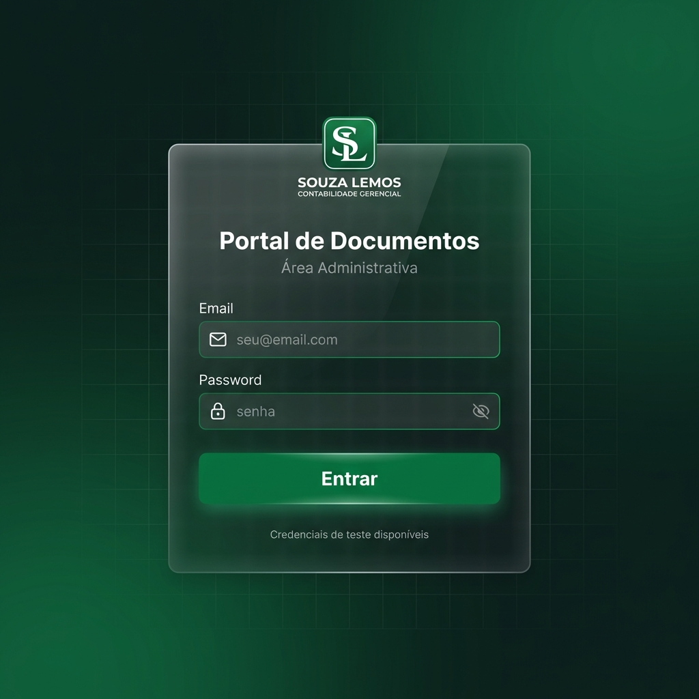
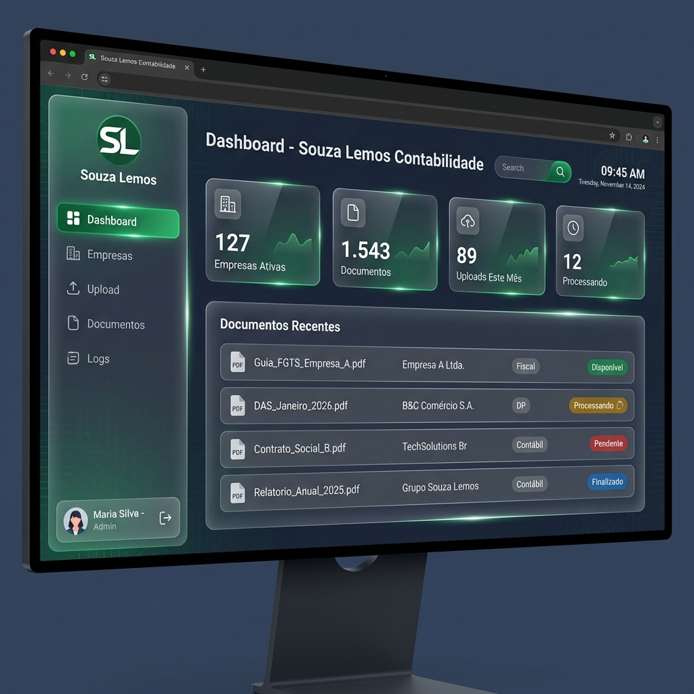
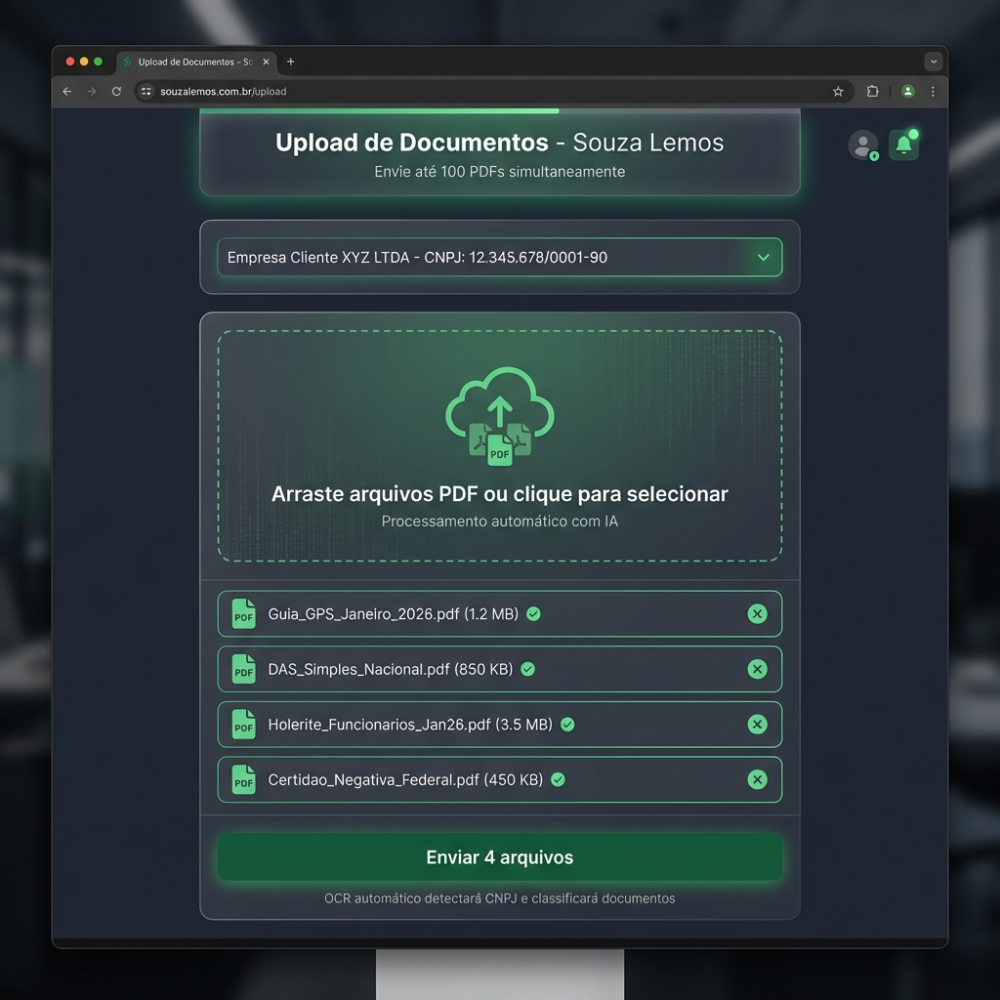
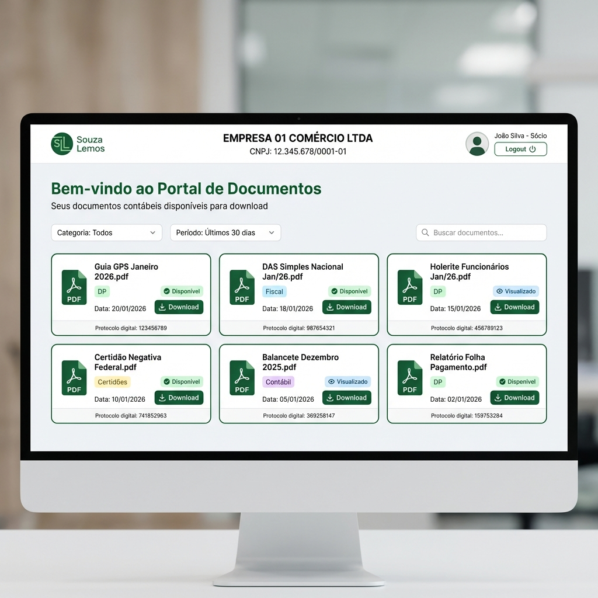

# 📄 Portal de Gestão de Documentos Contábeis

> Sistema SaaS para automação completa da distribuição de documentos entre escritório de contabilidade e 500+ empresas clientes, com IA e conformidade LGPD.

[](https://nextjs.org/)
[](https://react.dev/)
[](https://nodejs.org/)
[](https://www.typescriptlang.org/)
[](https://azure.microsoft.com/)
[](https://www.postgresql.org/)

---

## 🎯 Visão Geral

Sistema que **elimina 40 horas/semana** de trabalho manual através de:

- 🤖 **OCR Inteligente** - Azure AI lê e classifica documentos automaticamente
- 🔐 **Segurança Bancária** - Criptografia AES-256 e conformidade LGPD
- ⚡ **Upload em Lote** - Até 100 PDFs de uma vez com drag & drop
- 📊 **Dashboard em Tempo Real** - Estatísticas e alertas instantâneos
- 🔒 **Protocolos Digitais** - Comprovante de entrega com hash SHA-256

---

## 🏗️ Arquitetura



### Fluxo de Dados

1. **Upload** → PDFs enviados pela contabilidade
2. **Azure AI** → Extrai CNPJ e classifica documento
3. **Blob Storage** → Armazena arquivo criptografado (AES-256)
4. **PostgreSQL** → Salva metadados e índices
5. **Portal Web** → Cliente acessa com link seguro

### Diagrama do Fluxo



---

## 🔐 Segurança e LGPD



### Conformidade Total

✅ Criptografia AES-256 (nível bancário)  
✅ Autenticação 2FA (Google Authenticator)  
✅ Logs inalteráveis de todas as ações  
✅ Protocolos digitais com hash SHA-256  
✅ Controle de acesso por níveis (4 perfis)  
✅ Rastreamento completo (IP + Data/Hora)  

---

## ⚙️ Automação Inteligente



### Processo 100% Automático

1. **Upload em Lote** - Até 100 PDFs simultaneamente
2. **Fila de Processamento** - BullMQ + Redis (assíncrono)
3. **OCR Inteligente** - Azure AI lê CNPJ automaticamente
4. **Classificação** - Identifica: Fiscal, DP, Contábil, Certidões
5. **Armazenamento** - Azure Blob Storage criptografado
6. **Notificação** - E-mail + WhatsApp para o cliente

**Resultado:** Zero trabalho manual após o upload! 🚀

---

## 💡 Diferenciais

| Recurso | Benefício |
|---------|-----------|
| 🤖 **IA Integrada** | Classifica documentos sem intervenção humana |
| ⚡ **Processamento Paralelo** | 100 documentos processados simultaneamente |
| 📈 **Escalável** | Suporta 500+ empresas sem degradação |
| 🔒 **Seguro** | Mesma infraestrutura usada por bancos |
| 📊 **Métricas** | Dashboard com estatísticas em tempo real |
| 💰 **ROI 1.500%** | Economia de 160h/mês × R$30/hora = R$4.800/mês |

---

## 🚀 Início Rápido

### Pré-requisitos

- Node.js 20+
- Docker Desktop
- Conta Azure (para OCR e Storage)

### 1️⃣ Clone o Repositório

```bash
git clone https://github.com/seu-usuario/portal-documentos-contabeis.git
cd portal-documentos-contabeis
```

### 2️⃣ Inicie o Banco de Dados

```bash
docker-compose up -d
```

### 3️⃣ Configure o Backend

```bash
cd backend
npm install
cp .env.example .env
# Edite .env com suas credenciais Azure

npx prisma migrate dev
npx prisma db seed
npm run dev
```

✅ Backend rodando em: **http://localhost:3001**

### 4️⃣ Configure o Frontend

```bash
cd frontend/admin
npm install
npm run dev
```

✅ Frontend rodando em: **http://localhost:3000**

### 5️⃣ Acesse o Sistema

**URL:** http://localhost:3000

**Credenciais de Teste:**
- Email: `admin@contabilidade.com`
- Senha: `admin123`

---

## 📁 Estrutura do Projeto

```
portal-documentos-contabeis/
├── backend/                    # API Node.js + Express
│   ├── api/                   # Controllers e Routes
│   ├── services/              # OCR e Storage
│   ├── jobs/                  # Background jobs (BullMQ)
│   ├── middleware/            # Auth, Audit, Validation
│   └── prisma/                # Database schema
├── frontend/
│   └── admin/                 # Dashboard Next.js
│       ├── app/               # Pages (login, dashboard, upload)
│       ├── components/        # Sidebar, Header
│       └── lib/               # API client, Store
├── docs/
│   ├── images/                # Diagramas de apresentação
│   └── APRESENTACAO.md        # Apresentação completa
└── docker-compose.yml         # PostgreSQL + Redis
```

---

## 🛠️ Tecnologias

### Backend
- **Node.js 20** + Express
- **PostgreSQL 15** + Prisma ORM
- **Azure AI Document Intelligence** (OCR)
- **Azure Blob Storage** (arquivos)
- **BullMQ** + Redis (filas)
- **JWT** + Speakeasy (2FA)

### Frontend
- **Next.js 14** + React 18
- **TypeScript**
- **TailwindCSS** (dark theme)
- **Zustand** (state)
- **Axios** (HTTP)
- **React Dropzone** (upload)

### DevOps
- **Docker** (desenvolvimento)
- **Azure App Service** (produção)
- **GitHub Actions** (CI/CD)

---

## 📊 Funcionalidades

### ✅ Implementado

- [x] Autenticação JWT + 2FA
- [x] Upload em lote (drag & drop)
- [x] OCR com Azure AI
- [x] Classificação automática
- [x] Criptografia AES-256
- [x] Logs de auditoria LGPD
- [x] Protocolos digitais
- [x] Dashboard com estatísticas
- [x] Gestão de empresas (CRUD)

### 🚧 Em Desenvolvimento

- [ ] Notificações (e-mail + WhatsApp)
- [ ] Portal do cliente
- [ ] Alertas de vencimento
- [ ] Relatórios personalizados

---

## 💰 Investimento e ROI

### Custo Mensal (Azure)

| Serviço | Valor |
|---------|-------|
| App Service | R$ 300-600 |
| PostgreSQL | R$ 180-300 |
| Blob Storage (100GB) | R$ 12-30 |
| Azure AI (OCR) | R$ 9,00/1000 páginas |
| **Total** | **R$ 600-1.200/mês** |

### Retorno sobre Investimento

- **Economia de Tempo:** 160h/mês
- **Valor/Hora:** R$ 30,00
- **Economia Mensal:** R$ 4.800,00
- **ROI:** **1.500%** 📈

---

## 📸 Screenshots

### Área Administrativa (Souza Lemos)

#### Login com 2FA


#### Dashboard


#### Upload Drag & Drop


### Portal do Cliente

#### Área do Cliente (Empresa 01)


*Visão da empresa cliente com acesso aos seus documentos, filtros por categoria/período, e download com protocolo digital.*

---

## 🔒 Segurança

- ✅ Criptografia AES-256 em repouso
- ✅ HTTPS obrigatório (SSL/TLS)
- ✅ Rate limiting (100 req/15min)
- ✅ Validação de entrada (Joi)
- ✅ Sanitização de SQL (Prisma)
- ✅ Tokens JWT com expiração
- ✅ Logs de auditoria inalteráveis

---

## 📄 Documentação

- [Apresentação Completa](docs/APRESENTACAO.md) - Para reuniões
- [Guia de Início Rápido](QUICK_START.md) - Setup em 5 minutos
- [Backend README](backend/README.md) - API e endpoints
- [Frontend README](frontend/admin/README.md) - Interface

---

## 🤝 Contribuindo

1. Fork o projeto
2. Crie uma branch: `git checkout -b feature/nova-funcionalidade`
3. Commit: `git commit -m 'Add: nova funcionalidade'`
4. Push: `git push origin feature/nova-funcionalidade`
5. Abra um Pull Request

---

## 📝 Licença

Este projeto é proprietário e confidencial.

---

## 👨‍💻 Desenvolvedor

**Hugo**  
📧 Email: seu@email.com  
🔗 LinkedIn: [seu-perfil](https://linkedin.com)

---

## 🎬 Demonstração

Quer ver o sistema funcionando? Entre em contato para agendar uma demo!

**Transforme a gestão de documentos da sua contabilidade com IA!** 🚀

---

<div align="center">

**⭐ Se este projeto foi útil, deixe uma estrela!**

Made with ❤️ using Next.js, Node.js and Azure AI

</div>
